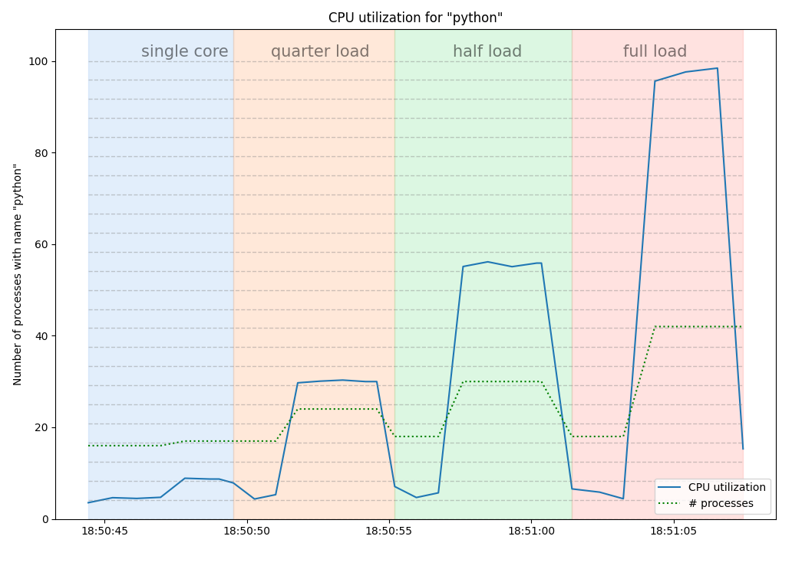

## CPUUsageLogger

A program that runs as a thread in the background and checks the CPU usage of processes with a given name.




## Installation

`pip install git+https://github.com/skjerns/skjerns-utils`

## Usage

```python
from joblib import Parallel, delayed
import psutil
from cpu_usage import CPUUsageLogger


def dummy_calculation(timeout=5):
    start = time.time()
    while time.time()-start<timeout:
        20**20

if __name__=='__main__':
    cpu_count = psutil.cpu_count()

    self = CPUUsageLogger()
    self.start('single core')

    print('single core')
    dummy_calculation()

    self.set_segment_name('quarter load')
    print('multi core (quarter load)')
    Parallel(n_jobs=cpu_count//4)(delayed(dummy_calculation)() for i in range(cpu_count//4))

    self.set_segment_name('half load')
    print('multi core (half load)')
    Parallel(n_jobs=cpu_count//2)(delayed(dummy_calculation)() for i in range(cpu_count//2))

    self.set_segment_name('full load')
    print('multi core (full load)')
    Parallel(n_jobs=cpu_count)(delayed(dummy_calculation)() for i in range(cpu_count))

    print('stop')
    self.stop()
    self.plot()
    plt.show(block=True)   plt.show(block=True)
```