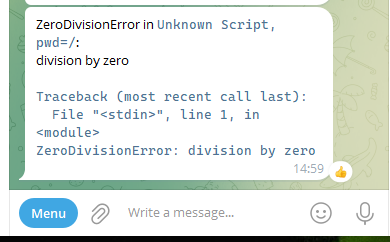

## Exception-Send

Import this library and any uncaught exception will be forwarded via the `telegram-send` command to your telegram bot.

Prerequesit: You have to install and setup `telegram-send` on you machine. Verify in your command line that `telegram-send test` works.

## Usage

```Python
import telegram_send_exception_forward

# now raise an exception to check if it works
# this will likely not work in an interactive session
3/0 # raises ZeroDivisionError
```

Now, any uncaught exception will result in a telegram message to your bot



```python
3/0 # raises ZeroDivisionError
```

In the background, the exception overwrites and monkey-patches the `sys.excepthook` with its the telegram sending logic, then raises the exception to the original excepthook of Python.
